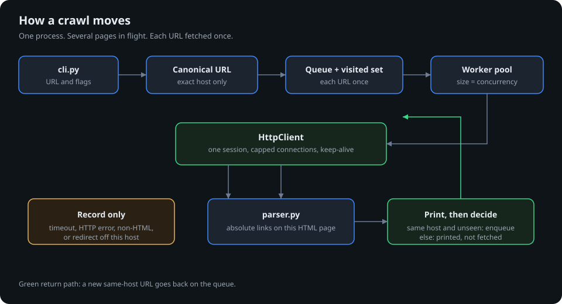
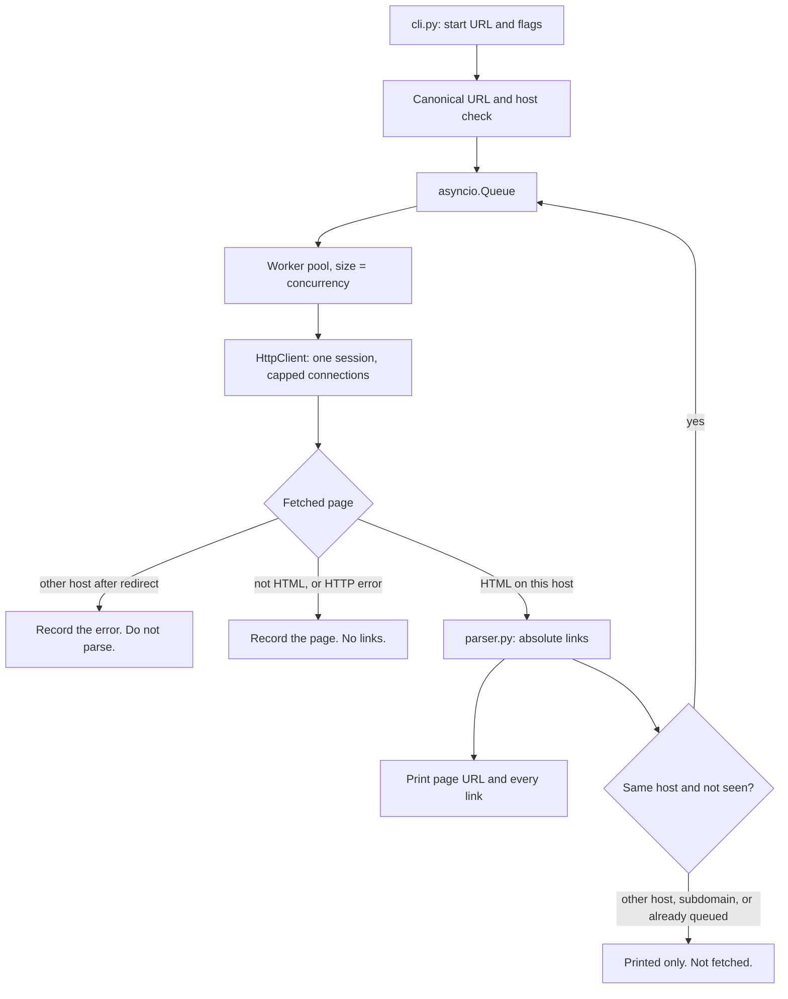
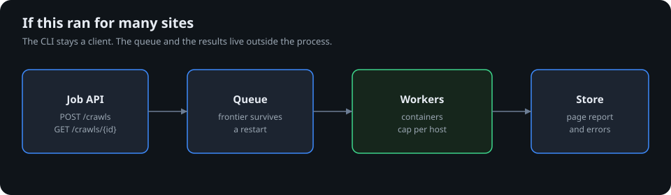

 python-developer-test

# Zego

## About Us

At Zego, we understand that traditional motor insurance holds good drivers back.
It's too complicated, too expensive, and it doesn't reflect how well you actually drive.
Since 2016, we have been on a mission to change that by offering the lowest priced insurance for good drivers.

From van drivers and gig economy workers to everyday car drivers, our customers are the driving force behind everything we do. We've sold tens of millions of policies and raised over $200 million in funding. And we’re only just getting started.

## Our Values

Zego is thoroughly committed to our values, which are the essence of our culture. Our values defined everything we do and how we do it.
They are the foundation of our company and the guiding principles for our employees. Our values are:

<table>
    <tr><td></td><td><b>Blaze a trail</b></td><td>Emphasize curiosity and creativity to disrupt the industry through experimentation and evolution.</td></tr>
    <tr><td></td><td><b>Drive to win</b></td><td>Strive for excellence by working smart, maintaining well-being, and fostering a safe, productive environment.</td></tr>
    <tr><td></td><td><b>Take the wheel</b></td><td>Encourage ownership and trust, empowering individuals to fulfil commitments and prioritize customers.</td></tr>
    <tr><td></td><td><b>Zego before ego</b></td><td>Promote unity by working as one team, celebrating diversity, and appreciating each individual's uniqueness.</td></tr>
</table>

## The Engineering Team

Zego puts technology first in its mission to define the future of the insurance industry.
By focusing on our customers' needs we're building the flexible and sustainable insurance products
and services that they deserve. And we do that by empowering a diverse, resourceful, and creative
team of engineers that thrive on challenge and innovation.

### How We Work

- **Collaboration & Knowledge Sharing** - Engineers at Zego work closely with cross-functional teams to gather requirements,
  deliver well-structured solutions, and contribute to code reviews to ensure high-quality output.
- **Problem Solving & Innovation** - We encourage analytical thinking and a proactive approach to tackling complex
  problems. Engineers are expected to contribute to discussions around optimization, scalability, and performance.
- **Continuous Learning & Growth** - At Zego, we provide engineers with abundant opportunities to learn, experiment and
  advance. We positively encourage the use of AI in our solutions as well as harnessing AI-powered tools to automate
  workflows, boost productivity and accelerate innovation. You'll have our full support to refine your skills, stay
  ahead of best practices and explore the latest technologies that drive our products and services forward.
- **Ownership & Accountability** - Our team members take ownership of their work, ensuring that solutions are reliable,
  scalable, and aligned with business needs. We trust our engineers to take initiative and drive meaningful progress.

## Who should be taking this test?

This test has been created for all levels of developer, Junior through to Staff Engineer and everyone in between.
Ideally you have hands-on experience developing Python solutions using Object Oriented Programming methodologies in a commercial setting. You have good problem-solving abilities, a passion for writing clean and generally produce efficient, maintainable scaleable code.

## The test 🧪

Create a Python app that can be run from the command line that will accept a base URL to crawl the site.
For each page it finds, the script will print the URL of the page and all the URLs it finds on that page.
The crawler will only process that single domain and not crawl URLs pointing to other domains or subdomains.
Please employ patterns that will allow your crawler to run as quickly as possible, making full use any
patterns that might boost the speed of the task, whilst not sacrificing accuracy and compute resources.
Do not use tools like Scrapy or Playwright. You may use libraries for other purposes such as making HTTP requests, parsing HTML and other similar tasks.

## The objective

This exercise is intended to allow you to demonstrate how you design software and write good quality code.
We will look at how you have structured your code and how you test it. We want to understand how you have gone about
solving this problem, what tools you used to become familiar with the subject matter and what tools you used to
produce the code and verify your work. Please include detailed information about your IDE, the use of any
interactive AI (such as Copilot) as well as any other AI tools that form part of your workflow.

You might also consider how you would extend your code to handle more complex scenarios, such a crawling
multiple domains at once, thinking about how a command line interface might not be best suited for this purpose
and what alternatives might be more suitable. Also, feel free to set the repo up as you would a production project.

Extend this README to include a detailed discussion about your design decisions, the options you considered and
the trade-offs you made during the development process, and aspects you might have addressed or refined if not constrained by time.

# Instructions

1. Create a repo.
2. Tackle the test.
3. Push the code back.
4. Add us (@nktori, @danyal-zego, @bogdangoie, @cypherlou, @marliechiller, @ZEGODiogoAlves, and @BarryMcAuley) as collaborators and tag us to review.
5. Notify your TA so they can chase the reviewers.

---

# SOLUTION

<p>
  
  
  
  
</p>

## Contents

- [Run it](#site-crawler)
- [How to run](#how-to-run)
- [Layout](#layout)
- [What it does](#what-it-does)
- [Design](#design)
- [Patterns used for speed](#patterns-used-for-speed)
- [Trade-offs](#trade-offs)
- [How I would productionize this](#how-i-would-productionize-this)
- [Testing](#testing)
- [Tools](#tools)

## site-crawler

Command-line crawler for a single host. For every HTML page it fetches, it prints that page URL and every absolute link found on it. Links to other hosts, including subdomains, are printed and then ignored.

Some system Pythons, including Homebrew, refuse a system-wide `pip install` (`externally-managed-environment`). Install into a virtual environment inside the cloned folder.

```bash
git clone <repository-url>
cd site_crawler
python3 -m venv .venv
source .venv/bin/activate
pip install -e ".[dev]"
pytest
python -m site_crawler https://example.com --concurrency 10 --max-pages 20
```

On Windows, activate with `.venv\Scripts\activate` instead of `source .venv/bin/activate`.

After activation, the prompt shows `(.venv)`. `pytest` and `site-crawler` both use that environment. A bad start URL prints an error and exits with code 2.

This is a command-line program. It crawls the URL you pass, prints the result, and exits. There is no server to host.

Flags:

- `--concurrency 10` limits how many pages are fetched at once
- `--timeout 10` is the per-request timeout in seconds
- `--max-pages 20` stops after that many pages

## How to run

From the cloned folder, with the virtual environment active:

```bash
source .venv/bin/activate
python -m site_crawler https://toscrape.com/ --max-pages 3
```

After `pip install`, the same program is available as `site-crawler`:

```bash
site-crawler https://toscrape.com/ --concurrency 4 --timeout 10 --max-pages 3
```

Pass one absolute `http` or `https` URL. The process prints each page and the links on it, then exits. There is no server to start.

## Layout

| File | Responsibility |
|---|---|
| `src/site_crawler/cli.py` | `argparse`, URL and flag checks, then the crawl |
| `src/site_crawler/client.py` | `aiohttp` session, connection cap, `User-Agent`, timeouts and HTTP errors as records |
| `src/site_crawler/parser.py` | HTML to absolute links. Fragments, `mailto:`, and `javascript:` are dropped |
| `src/site_crawler/url_utils.py` | Canonical URLs and the exact-host check |
| `src/site_crawler/crawler.py` | Queue, visited set, and the worker pool |
| `tests/conftest.py` | In-process site used by the crawler tests |
| `pyproject.toml` | Dependencies and the `site-crawler` command |

The parser keeps off-site links in the list. The brief asks for every URL found on the page. `crawler.py` is what refuses to fetch other hosts and subdomains.

## What it does

`Crawler` resolves the start URL, then runs a fixed pool of async workers over one shared `aiohttp` session. A URL is fetched only if its hostname is exactly the start hostname. `www.example.com` and `blog.example.com` are not crawled when the start host is `example.com`.

Output for one page looks like this:

```text
https://example.com/
  https://example.com/a
  https://blog.example.com/post
  https://other.test/x
```

## Design





**Async workers, not threads.** Crawling is I/O-bound: most of the time is spent waiting on a remote server. `asyncio` lets one process switch to another request during that wait, so local CPU stays low while several pages are in flight. A thread per request would spend the same wait and cost an OS thread each. `--concurrency` caps both workers and pooled connections, so a faster crawl does not open an unlimited number of sockets.

**Breadth-first queue.** Workers pull from one `asyncio.Queue`. The visited set is updated before enqueue, so two pages that link to the same URL schedule it once.

**Print every link, follow same-host links only.** The brief asks for the URLs found on the page, and separately says not to crawl other domains or subdomains. Off-site links are part of the page report and are not fetched.

**Canonical URLs.** Fragments are removed, scheme and host are lower-cased, and default ports are dropped. Path and query are preserved, because `/docs` and `/docs/` can differ.

**HTML only.** A non-HTML response is recorded with no links. A redirect whose final host differs from the start host is not parsed. `mailto:` and `javascript:` hrefs are not URLs of pages, so they are dropped.

**Stdlib parser via BeautifulSoup.** `html.parser` needs no native build. `lxml` would be faster on large pages; it was not worth the install for this size of crawl.

## Patterns used for speed

The crawl waits on the network, so the speedup comes from overlapping those waits and from not fetching the same URL twice. Local CPU stays small because there is one process and one event loop.

- **Concurrent async fetches.** A pool of workers pulls from one `asyncio.Queue`. While one request waits for a response, the others keep downloading. `--concurrency` is the size of that pool (default 10).
- **One shared session and a connection pool.** `HttpClient` opens a single `aiohttp` session. `TCPConnector(limit=concurrency)` reuses sockets (HTTP keep-alive) and refuses to open more connections than there are workers. A new TCP handshake is not paid on every page.
- **A cap, so speed does not become waste.** Unbounded parallelism would burn file descriptors and memory for little extra throughput. The same number limits workers and connections.
- **Enqueue each URL once.** The visited set is updated before the URL goes on the queue. Two pages that link to the same address schedule one fetch. A cycle stops instead of crawling forever.
- **Canonical URLs before the fetch.** Fragments are stripped and the host is lower-cased, so `https://Example.com/a#x` and `https://example.com/a` are one request.
- **Skip work that is not a page on this host.** `mailto:`, `javascript:`, and other non-HTTP links are never requested. Other domains and subdomains are printed and not fetched. A non-HTML response is not parsed. A redirect onto another host is not parsed either.

## Trade-offs

| Choice | Why | Cost |
|---|---|---|
| Exact hostname match | Matches "no subdomains" literally | `www` and the apex are different crawls |
| No robots.txt | Not required, and it can hide pages the brief asked to find | A production crawler should respect it |
| No rendered JavaScript | Playwright is disallowed, and most links are in the HTML | Client-rendered links are missed |
| Failures stay in the report | A timeout should not abort the crawl | The process still exits 0 if some pages fail |
| `--max-pages` optional | Keeps a large site from running away during a trial | Default is unbounded |

## How I would productionize this



The CLI is the right shape for one host and one run. It holds the queue in memory, prints to stdout, and exits. That does not survive a restart, and it cannot take a second site without starting a second process that knows nothing about the first. Production would split the crawl into a job, a queue, and a stored result.

**Job API instead of a command line.** A small service accepts `POST /crawls` with a start URL, concurrency, and page cap, and returns a job id. `GET /crawls/{id}` reports queued, running, finished, or failed, plus pages fetched and errors. Callers poll or receive a webhook. Several domains are several jobs. A per-host budget is shared across jobs so two crawls of the same site do not double the request rate.

**Durable queue and results.** The frontier and the visited set move out of process memory into a queue (for example SQS or Redis) and a store (Postgres or object storage for the page report). A worker crash resumes from the queue instead of starting over. Each URL is still enqueued once. Page records keep the URL, the links, the status, and the error string this CLI already prints.

**Several workers, one host limit.** The async pool stays inside each worker. More than one worker process can consume the queue. Concurrency is capped per host, not only per process, so adding machines does not open an unlimited number of sockets to one site. If the product needs the link graph across domains, store edges (from URL, to URL, host) in a graph store. The page report stays the source for what was fetched.

**Politeness and failures.** Respect `robots.txt`, wait a per-host delay, and send a contact `User-Agent`. Retry timeouts and `429`/`5xx` with backoff. A page that still fails is stored as a failed record. The job fails only when the worker cannot make progress. Trailing-slash canonicalisation waits until the server proves the two URLs are the same resource.

**Run it as a container.** Ship the worker image, configure the queue URL and store through the environment, and run one API service plus a worker service. Logs and metrics cover pages fetched, error rate, and queue depth. CI runs `pytest` on each change. The CLI can stay as a thin client that creates a job and prints the stored report.

**On AWS.** The API runs on Fargate or App Runner. Workers run on Fargate and pull from SQS. The page report goes in Postgres or S3. Use EKS only if the Kubernetes files under `deploy/` are what should schedule the pods. The HTTP request still only records the job. The worker does the crawl.

## Testing

`pytest` covers the parser, URL rules, cycles, nested pages, and HTTP errors against an in-process site. The commands below check the messages a person sees from the terminal. Run them with the virtual environment active. The first three refuse to crawl, print to stderr, and exit 2. The rest still crawl: the error is printed on that page’s line, in parentheses, and the process exits 0.

```text
$ python -m site_crawler not-a-url
start URL must be an absolute http(s) URL
exit 2

$ python -m site_crawler https://example.com --concurrency 0
concurrency must be >= 1
exit 2

$ python -m site_crawler https://example.com --timeout 0
timeout must be > 0
exit 2

$ python -m site_crawler https://httpbin.org/status/404 --max-pages 1
https://httpbin.org/status/404  (HTTP 404)
exit 0

$ python -m site_crawler "https://httpbin.org/redirect-to?url=https://example.com&status_code=302" --max-pages 1
https://httpbin.org/redirect-to?url=https://example.com&status_code=302  (redirected off-site)
exit 0

# nothing is listening on port 9; the text after the host can vary
$ python -m site_crawler http://127.0.0.1:9/ --timeout 2 --max-pages 1
http://127.0.0.1:9/  (Cannot connect to host 127.0.0.1:9 ...)
exit 0

# /delay/8 waits 8 seconds; --timeout 1 gives up first
$ python -m site_crawler https://httpbin.org/delay/8 --timeout 1 --max-pages 1
https://httpbin.org/delay/8  (timeout)
exit 0
```

## Tools

I wrote this on my machine in [Cursor](https://cursor.com), with a local `.venv`. [Homebrew](https://brew.sh) Python refuses a system-wide `pip install`, so the environment stays inside the project.

[Copilot](https://github.com/features/copilot) and [Cursor](https://cursor.com) sat in the editor while I worked. I used them to compare a thread pool with [`asyncio`](https://docs.python.org/3/library/asyncio.html) for this I/O-bound crawl, to sketch the split between fetch, parse, and the queue, and to fill in [pytest](https://docs.pytest.org/) cases for cycles, nested pages, and HTTP errors. I kept the design and reviewed the result myself. Tests run against an in-process [aiohttp](https://docs.aiohttp.org/) site, not the public internet. No [Scrapy](https://scrapy.org/), no [Playwright](https://playwright.dev/python/), and no [lxml](https://lxml.de/) (the stdlib [HTML parser](https://docs.python.org/3/library/html.parser.html) avoids a native build).

To learn the problem, I used the Python docs for [`asyncio`](https://docs.python.org/3/library/asyncio.html) and [`urllib.parse`](https://docs.python.org/3/library/urllib.parse.html), the [aiohttp](https://docs.aiohttp.org/) docs for one shared session, connection limits, and timeouts, and the [BeautifulSoup](https://www.crummy.com/software/BeautifulSoup/bs4/doc/) docs for pulling `href`s with the stdlib HTML parser. I also viewed the source of a couple of small pages to see how relative links, fragments, and off-site links actually appear.

To check the work beyond the test suite, I crawled [https://toscrape.com/](https://toscrape.com/) and ran the error cases: a bad URL, `--concurrency 0`, `--timeout 0`, an HTTP 404, an off-site redirect, a closed port, and a request timeout.